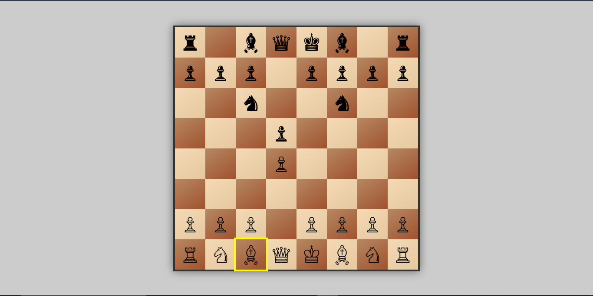
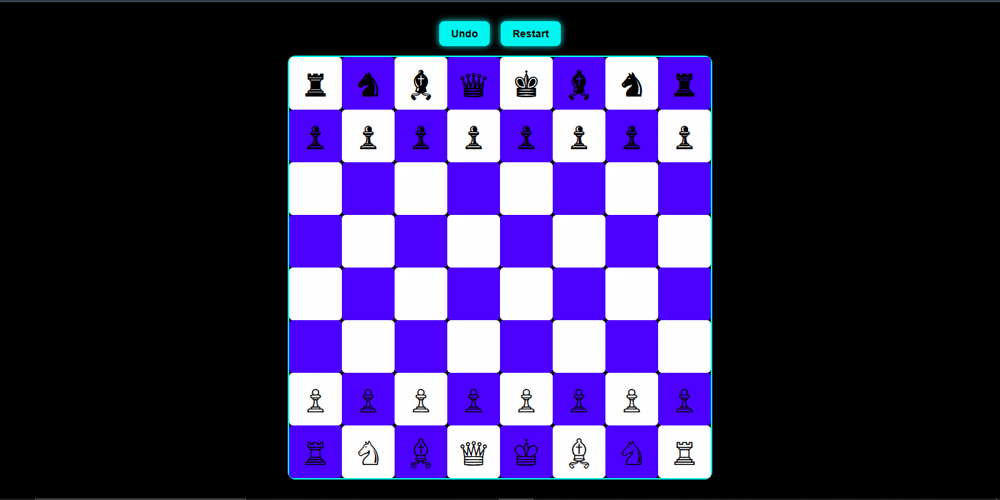

# ♟️ Web Chess Game  

<p align="center">
  
  
  
</p>

<p align="center">
  <b>Interactive Web Chess with AI Opponent</b><br>
  Play chess in your browser with smooth moves, smart AI, and stylish board.
</p>

---

## 🚀 Features  

- Smooth animated chess moves  
- Built-in AI opponent  
- Real chess rules (check & capture)  
- Custom styled chess pieces  
- King in-check highlight  
- Mobile + Desktop responsive  

---

##  Demo  

<p align="center">
  
</p>

---

## 🛠️ Tech Stack  

<p align="center">
  
</p>

- HTML5  
- CSS3  
- JavaScript  
- DOM Logic  
- Chess AI  

---

## 📂 Project Structure  

```text
Chess-Game
│── op.html
│── style.css
│── funtion.js
│── README.md
```

---

### Update new

- Removed AI bot: Now supports two human players.

- Enhanced functions: Game logic has been refined and made more distinct.

- Modern UI: User interface updated with sleek, futuristic styling.

- Improved experience: Smooth interactions, glowing neon board, and animated effects.

### update demo UI
---

